# Conteúdo - Aulas 29/08 e 02/09

Liana é linda!

Responsividade:

1 [Layout Responsivo](#layoutResponsivo)

2 [Resolução de tela x Tamanho de tela](#resolucaoTamanho)

3 [Unidades de medida responsivas](#unidadesMedida)

4 [Imagens responsivas](#imagensResponsivas)

5 [Breakpoints & Media Queries](#breakpointsMedia)

6 [Tipos de displays](#displays)

7 [Mobile First](#mobileFirst)

**[Exercício para sexta](#exercicio)**

---
- [Link para dontpad](http://dontpad.com/responsividadeOn8); 
---

# Responsividade

<div id='layoutResponsivo'></div>

## Layout Responsivo 

Um **layout responsivo** é aquele que se "adapta" automaticamente aos dispositivos no qual ele está sendo visualizado, e é parte fundamental do conceito de **design responsivo**, que nada mais é do que a possibilidade de **adaptação fluida** de um site a diversos tamanhos de tela.


**Tipos de dispositivos:**

* Notebooks
* Tablets
* Celulares
* Desktops  
* Televisões


**Alguns fundamentos para a construção de um layout responsivo são:**

* Redimensionar imagens automaticamente
* Simplificar e/ou ocultar elementos
* Adaptar o tamanho de botões e links para interfaces touch

**Responsivo vs adaptativo:**

O design responsivo expande de forma fluída, enquanto o adaptativo aguarda a tela terminar a expansão.


**Vantagens:**

* Usabilidade (design adaptado para diversos formatos)
* Manuntenção (não precisa desenvolver outras versões)
* SEO Google (tudo em uma url só)

**Desvantagens:**

* Desenvolvimento apenas para os principais dispositivos do mercado
* Versões antigas de navegadores que não reconhecem a linguagem de adapatação
* Necessidade de uma pré construção da arquitetura do código e do layout
* Um pouco mais demorado para carregar 

---

<div id='resolucaoTamanho'></div>

## Resolução de tela x Tamanho de tela

**Resolução:** é a medida de definição de imagens digitais, que utiliza o **pixel** como unidade de medida.

**Tamanho de tela:** tamanho físico da tela, normalmente medido em polegadas.

* Pixels por polegada: PPI - _**P**ixels **P**er **I**nch_ para monitores e telas

É fundamental termos em mente que **a resolução é determinada pelo tamanho da tela (expresso pela sua altura e largura) mais a quantidade de pixels nela inserida.**

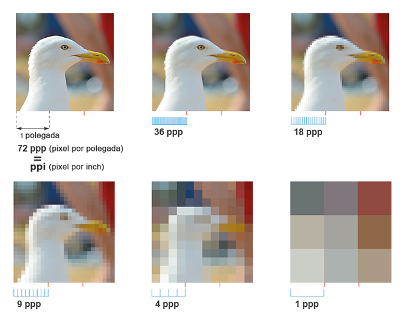

Dessa forma, olhando simplesmente para o tamanho (largura x altura) **não podemos afirmar que esse possui alta ou baixa resolução. A quantidade de pixels contidas nele, é que dirá se o mesmo possui alta ou baixa resolução.**

Podemos ter um tamanho de tela com dimensões grandes porém com poucos pixels. O inverso também é possível, um tamanho com dimensões pequenas porém com muitos pixels. Assim, **dispositivos que possuem o mesmo tamanho nem sempre possuem uma mesma resolução.** 

---

<div id='unidadesMedida'></div>

## Unidades de medida responsivas


### Medidas absolutas:

Essas são as mais comuns que vemos no dia a dia. São medidas que não estão referenciadas a qualquer outra unidade, ou seja, não dependem de um valor de referência.

Essas medidas são **estáticas** não mudam de acordo com as especificações do dispositivo.

_Quais são:_ **pixels (px)**, points (pt), inches/polegadas (in), centímetro (cm), milímetro (mm) e paica (pc)

* 96px = 1 in = 2,54cm = 25,4mm = 72pt = 6pc

### Medidas relativas:

Essas são as que normalmente não estamos habituados. Essas medidas são calculadas tendo como base uma outra unidade de medida pré definida.

Devido ao fato de que essas medidas serem calculadas pelo browser baseando-se em outra unidade, elas tendem a ser bastantes **flexíveis**. Ou seja, podemos ter resultados diferentes de acordo com o tamanho de tela. 

_Quais são:_

* em

    **EM** é uma unidade de **medida tipográfica**. Para entender sua aplicação, vamos utilizar o exemplo abaixo onde foi definido um tamanho de fonte no elemento `<div>`, o valor de **em** declarado em qualquer elemento-filho dentro de `<div>` será igual a: **o valor declarado no elemento-filho * o valor declarado no elemento pai**. 

    Nesse caso: **1.2(em) * 14px = 16.8px**

    [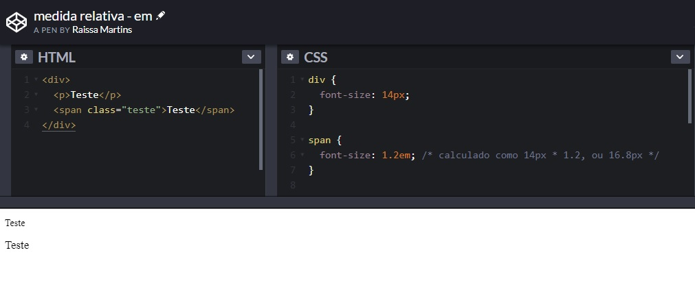](https://codepen.io/raissamartinsmenezes/pen/BaazMzm)

    Entretanto, o que acontece quando se tem um elemento com valor **em** dentro de outro elemento com valor **em**?

    [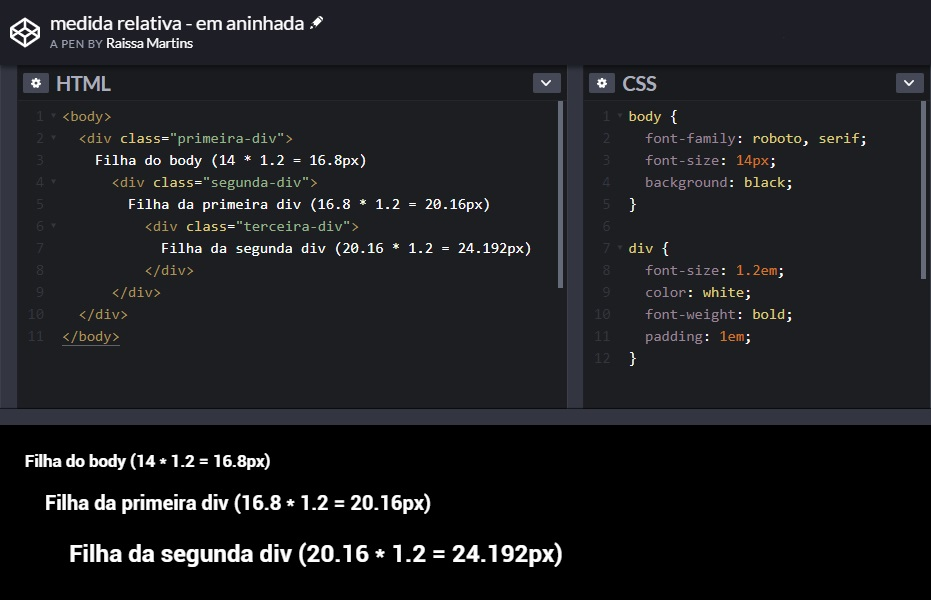](https://codepen.io/raissamartinsmenezes/pen/OJJXdzQ)

    [Calculadora online: px para em](http://pxtoem.com/)

* rem

    O **REM** vem como sucessor do **EM** e ambos compartilham a mesma lógica de funcionamento, porém a forma de implementação é diferente. Enquanto o em está diretamente relacionado ao tamanho da fonte do elemento pai, o **rem** está relacionado com o tamanho da fonte do **elemento root (raiz)**. Embora sejam medidas tipográficas, **REM e EM** também podem ser utilizadas para outras finalidades, na atribuição de valores para margins e paddings por exemplo.  

    [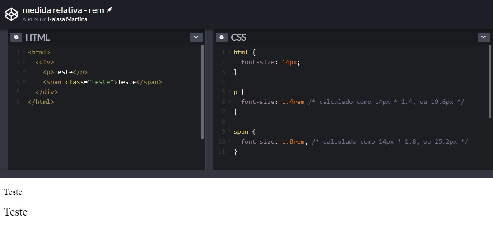](https://codepen.io/raissamartinsmenezes/pen/LYYRZam)

    [Calculadora online: px para rem](https://daniellamb.com/experiments/px-to-rem-calc/)

* porcentagem %

    Apesar de não ser uma unidade de medida, a porcentagem costuma ser bastante utilizada quando falamos de layout responsivo e fluido por conta de seu caráter adaptativo.

    [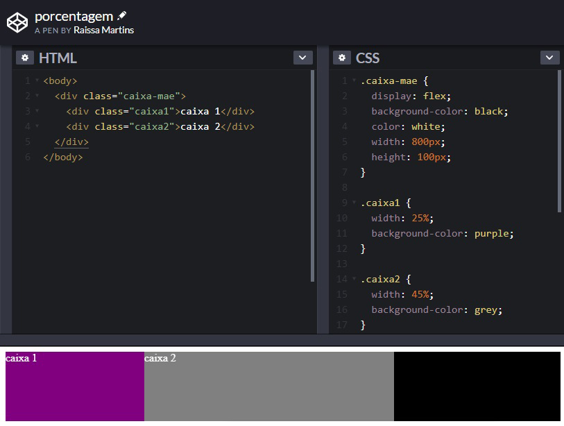](https://codepen.io/raissamartinsmenezes/pen/abbmJvY)  

    A porcentagem permite que criemos elementos que sempre vão se readaptar para ocupar a quantidade especificada.

    [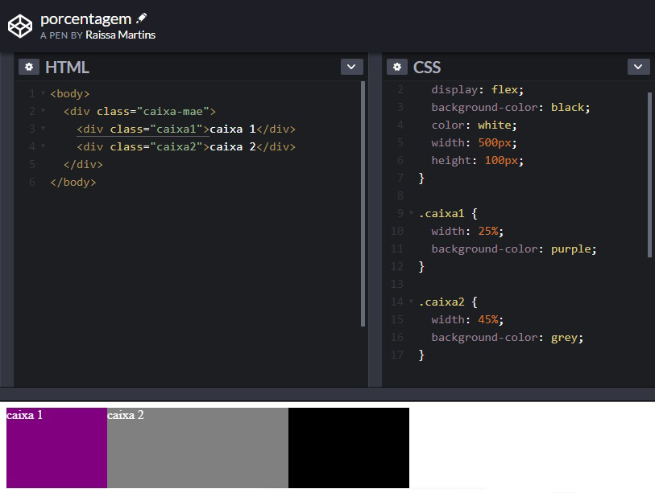](https://codepen.io/raissamartinsmenezes/pen/abbmJvY)

    **Note que a propriedade `width:` é relativa ao elemento-ancestral mais próximo.** 

* vh e vw

    Muitas técnicas de web design responsivo dependem muito de regras percentuais. **Mas e se fosse preciso usar a largura ou a altura da viewport ao invés da largura do elemento-pai?** Isso é exatamente o que as unidades vh e vw proporcionam.

    A medida vh é igual a **1/100** da altura da viewport. Então, por exemplo, se a altura do navegador é 900px, 1vh equivale a 9px e, analogamente, se a largura da viewport é 750px, 1vw equivale a 7.5px. Sendo assim, **1vw = 1% da largura da viewport e 1vh = 1% da altura da viewport**.

    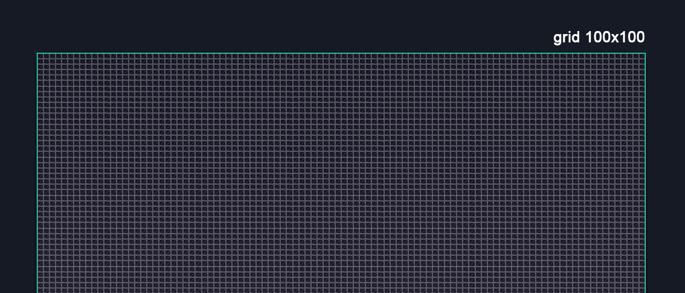

    Vamos conferir o [exemplo 😊](./exemplos/exemplo-medidas-viewport.html)

* Outras unidades de medida

    **vmax e vmin:** [UNIDADES CSS RELATIVAS: VW, VH, VMAX, VMIN (CSS3)](https://www.youtube.com/watch?v=g__c-7M9Xzk&t=94s)

    **ex e ch:** [UNIDADES CSS RELATIVAS: %, REM, EM, CH, EX (CSS3)](https://www.youtube.com/watch?v=etM0JBeFbf8)

---

<div id='imagensResponsivas'></div>

## Imagens responsivas

Imagens responsivas respondem ao tamanho da tela para escalar proporcionalmente, sem ficar pixeladas ou desproporcionais.

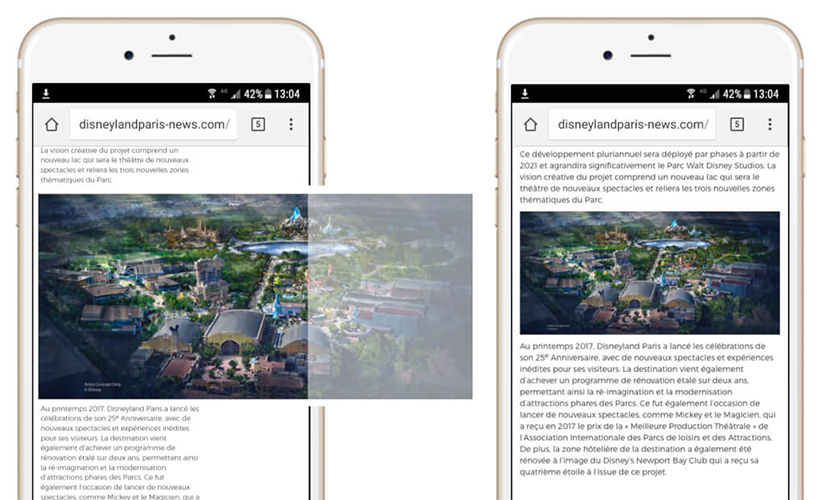

Uma técnica para conseguirmos ter imagens responsivas é a seguinte:

```css
.img-responsiva {
  width: 100%;
  max-width: 100%;
  height: auto;
}
```

Criamos uma classe que podemos aplicar a todas as imagens que estão no html que queremos que fiquem responsivas. As imagens que tiverem essa classe vão ter 100% de largura com altura sempre proporcinal a altura. O atributo `max-width: 100%` vai assegurar que essa imagem não estique mais do que o tamanho original dela permite.


---

<div id='breakpointsMedia'></div>

## Breakpoints e Media Queries

**Media queries** é uma técnica de consulta de mídia que atribui diferentes estilos CSS para cada resolução de tela detectada.

As media queries definem condições para utilização de estilos CSS. Se o dispositivo de acesso do usuário se adequar as **condições** definidas, se aplicam os estilos definidos nos elementos. 

Os **breakpoints** podem enfim serem aplicados graças as media queries, pois seus valores são utilizados na sintaxe definindo a partir de qual ponto os estilos CSS serão aplicados.


**Importante:** Quando formos utilizar media queries, o primeiro passo é adicionar uma metatag chamada viewport no do site. Essa tag vai passar instruções para o browser renderizar o conteúdo do site conforme o tamanho do dispositivo.

```html
<head>
  <meta charset="utf-8">
  <meta name="viewport" content="width=device-width, initial-scale=1">
  <link href="css/style.css" rel="stylesheet">
</head>
```

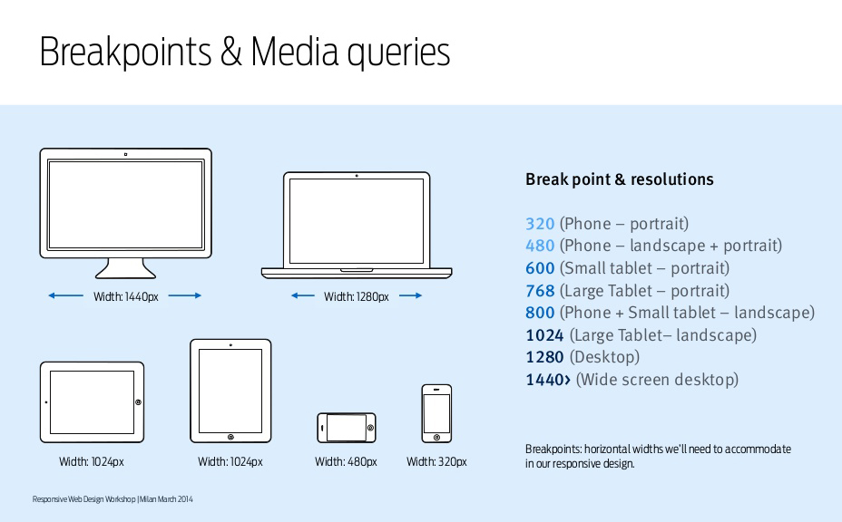

**Sintaxe:**

```css
/* condição até 600px */
@media (max-width: 600px) { 
  .nome-da-classe {
    color: #fff; /* elemento que vai ser modificado/adicionado/sobrescrito nessa resolução */
  }
}

/* condição a partir de 900px */
@media (min-width: 900px) { 
  .nome-da-classe {
    color: #fff; /* elemento que vai ser modificado/adicionado/sobrescrito nessa resolução */
  }
}

/* condição a partir de 600px até 900px */
@media (min-width: 600px) and (max-width: 900px) { 
  .nome-da-classe {
    color: #fff; /* elemento que vai ser modificado/adicionado/sobrescrito nessa resolução */
  }
}
```

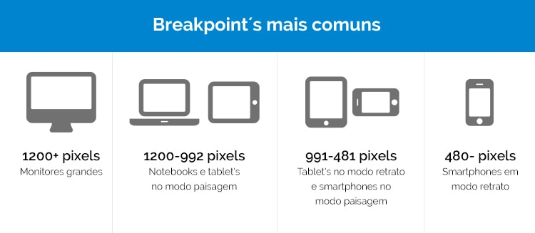

Vamos analisar sua aplicação no [exemplo 😊](./exemplos/exemplo-media-queries.html)

_Para saber mais:_

* [Media Queries MDN](https://developer.mozilla.org/pt-BR/docs/Web/Guide/CSS/CSS_Media_queries)
* [Mobile Test Me](http://mobiletest.me/)

---

<div id='displays'></div>

## Tipos de displays
### Flex

Vamos entender como o flex funciona [aqui!](https://codepen.io/raissamartinsmenezes/pen/XWWNbrP)

[Guia completo de Flexbox](https://origamid.com/projetos/flexbox-guia-completo/)

Vamos praticar transformando um layout feito para desktop em responsivo 📲 

### Grid

[Guia completo de Grid](https://www.origamid.com/projetos/css-grid-layout-guia-completo/)

---

<div id='mobileFirst'></div>

## Mobile First


Mobile First é um método onde o foco do desenvolvimento de projetos web está direcionado aos dispositivos móveis. A técnica prioriza a construção da arquitetura mobile, seguida do pensamento para desktops. O conceito está cada vez mais popular no mercado da comunicação e da tecnologia.

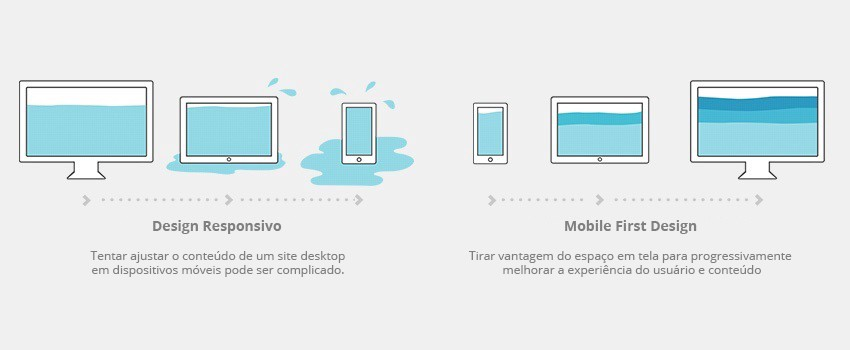

**Vantagens:**

* Otimização do site para o celular
* Os conteúdos precisam ser disponibilizados de forma mais otimizada e não há espaço para informações irrelevantes
* Sites limpos, funcionais e visualmente agradáveis

**Desvantagem:**

* Limitação criativa do projeto

--- 

<div id='exercicio'></div>

## Exercícios

---
**Exercício Principal** 

* Transformar o layout da sua página criada na semana passada (html e css) em responsivo também para dispositivos como celulares e tablets. 
---
**Exercício extra** 

* Criar o layout da página Mundo Gelado e torná-lo responsivo dentro das imagens sugeridas abaixo para os tamanhos de tela e seguindo as especificações de fontes, tamanhos e cores. 

**Layout Desktop**

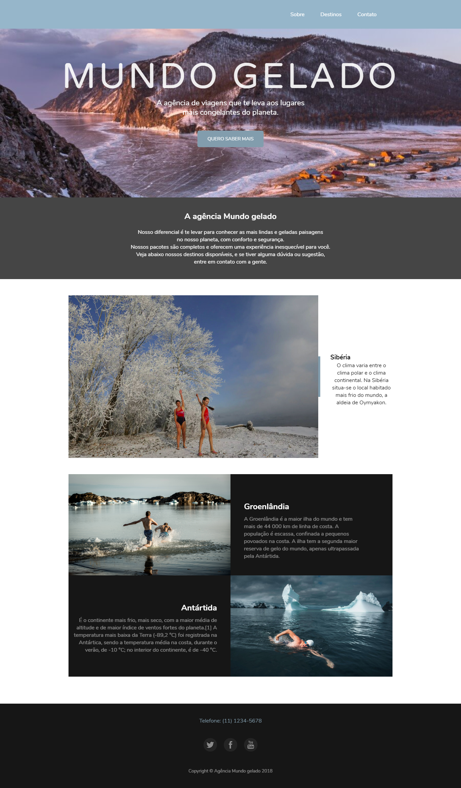

**Layout Mobile**


**Fontes:**

Fonte padrão do site: Nunito

Fonte dos títulos: Varela Round

_Ambas fontes estão disponíveis no Google Fonts._

**Tamanho das fontes:**

Título principal: 105px

Títulos secundários: 22px

Botões e links: 13px

Parágrafos: 14px

**Cores:**

Header menu: #a0bed0 

Background: #f8f9fa 

Botões e bordas azuis: #829dad 

Botões hover: #36b0e0 

Preto: #161616 

Branco opaco: #fff (com 50% de opacidade - _opcional, pode ser o branco tradicional_)

Preto opaco: #000 (com 50% de opacidade - _opcional, pode ser o preto tradicional_)

Título: #fff 

---
**Links úteis para realização do exercício :)**

[Como usar as fontes do google](https://www.anicasagrande.com.br/google-fonts-o-que-e-como-funciona-e-como-usar/)

[Metodologia BEM para nomeação de classes e uso no CSS](https://medium.com/@fnandaleite/metodologia-bem-para-css-b0d3269b4853)

[Aplicando opacidade na cor](https://developer.mozilla.org/pt-BR/docs/Web/CSS/opacity)

[Box-model - Entendendo como funciona elementos no HTML](https://tableless.github.io/iniciantes/manual/css/box-model.html)

[Propriedade object-fit para ajuste de imagens no CSS](https://cahfelix.com/entendendo-o-object-fit/)

[A propriedade display no CSS - block, inline e none](https://tableless.github.io/iniciantes/manual/css/display.html)

[Como usar os seletores CSS - Um guia completo](https://ayltoninacio.com.br/blog/como-usar-os-seletores-css-um-guia-completo)

[Conheça os elementos semânticos do HTML](https://www.devmedia.com.br/html-semantico-conheca-os-elementos-semanticos-da-html5/38065)

[Centralizando conteúdos com `<div>s` no HTML](https://www.devmedia.com.br/como-centralizar-divs-em-html-e-css/37568)

[CSS reset de várias maneiras](https://woliveiras.com.br/posts/css-reset-de-varias-maneiras/)

[Como utilizar a técnica CSS reset](https://www.devmedia.com.br/como-utilizar-a-tecnica-css-reset/26797)

[Elementos HTML](https://developer.mozilla.org/pt-BR/docs/Web/HTML/Element)

[Efeito cascata, herança e especificidade no CSS](https://tableless.com.br/efeito-cascata-e-especificidade-do-css/)

[Introdução a HTML e CSS](https://www.caelum.com.br/apostila-html-css-javascript/introducao-a-html-e-css/)

[Devmedia - Utilizando media queries](https://www.devmedia.com.br/utilizando-css-media-queries/27085)


<!-- ---

#### Referências utilizadas para a construção deste material

* [Repositório - On3-Responsivo](https://github.com/reprograma/On3-Responsivo)
 -->


